# Medical neighbor assistant 医邻助手

<b>医邻助手——社区家庭医生问诊管理系统</b>

## 系统设计

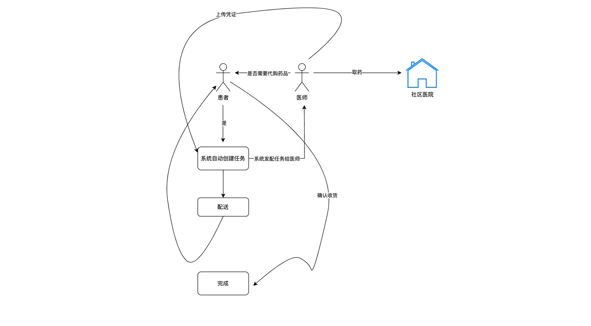
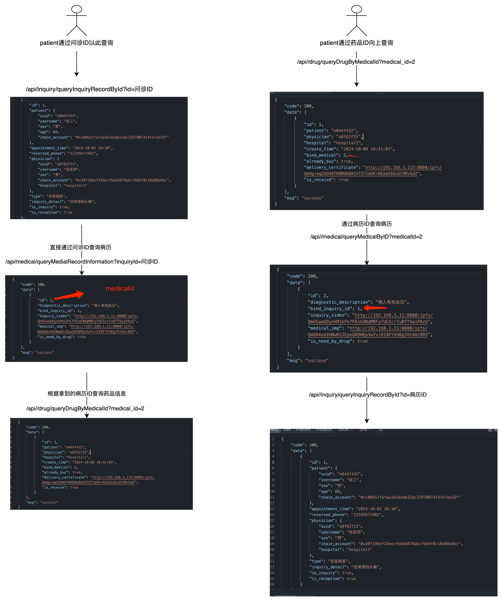

## 项目结构 🧐

| 子项目名 | 项目路径                                               |
|------|----------------------------------------------------|
| 后端服务 | [/medHealth/back](back/dd/医邻助手.md)             |
| 智能合约 | [/medHealth/truffle/contract](./truffle/contracts) |

## 项目功能 🎯

| 功能模块 | 功能描述 |
|------|------|
| 用户管理 | 用户注册、登录、信息修改、信息查询 |
| 医生管理 | 医生注册、登录、信息修改、信息查询 |
| 问诊管理 | 用户向医生发起问诊、医生接单、问诊记录查询 |
| 药品管理 | 药品信息管理、药品库存管理、药品购买 |
| 账单管理 | 账单生成、账单查询、账单支付 |

## 软件截图
<table>
    <tr>
        <td>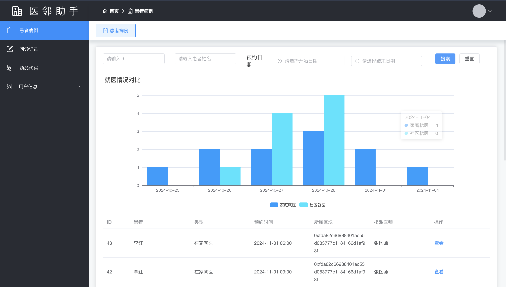</td>
        <td>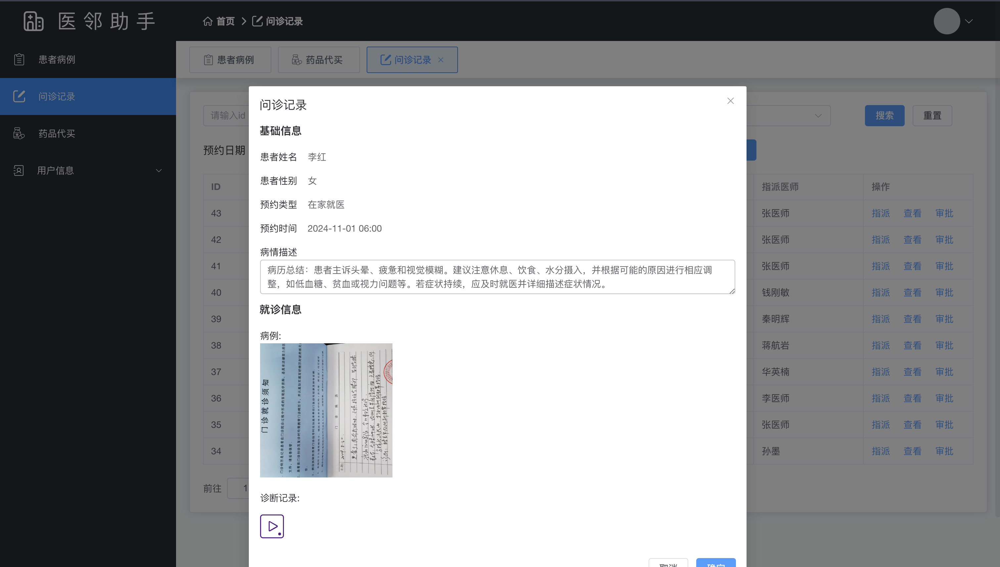</td>
    </tr>
    <tr>
        <td>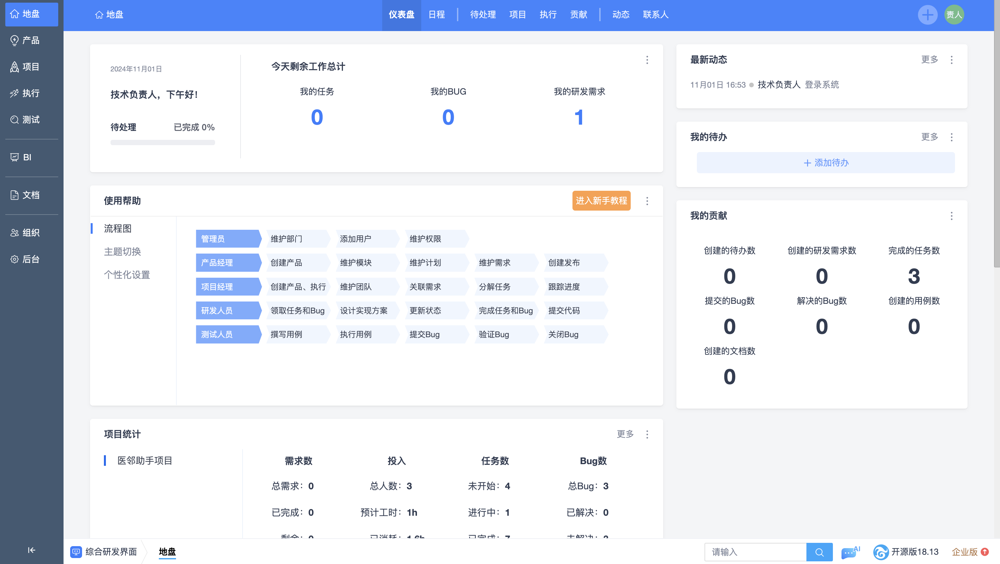</td>
        <td>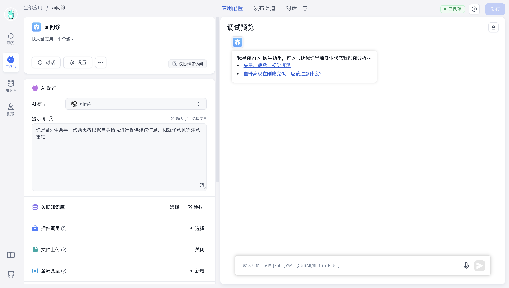</td>
    </tr>
    <tr>
        <td>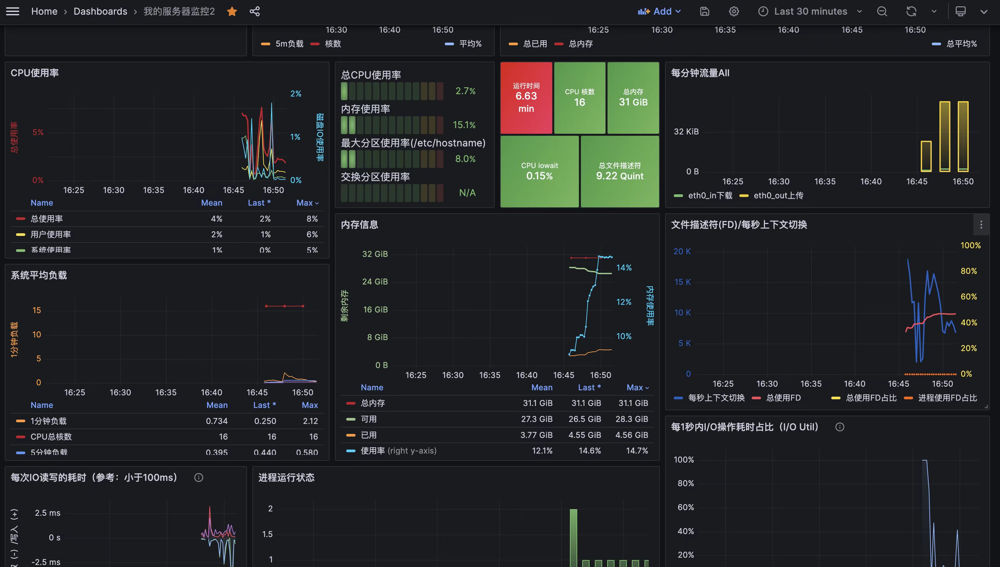</td>
        <td>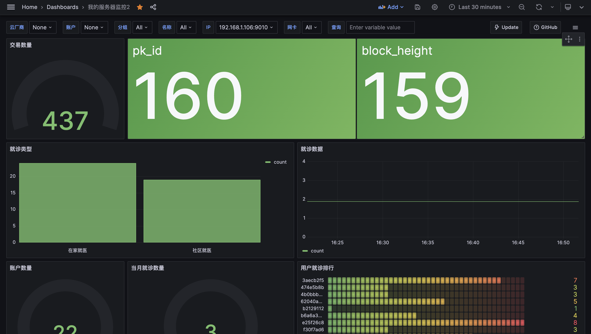</td>
    </tr>
    <tr>
        <td>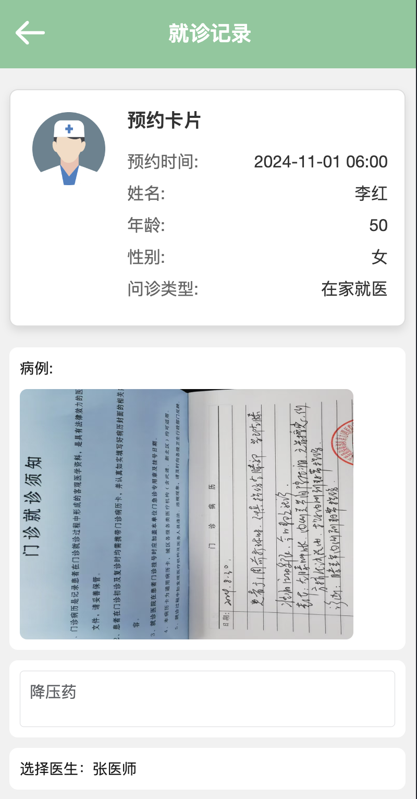</td>
        <td>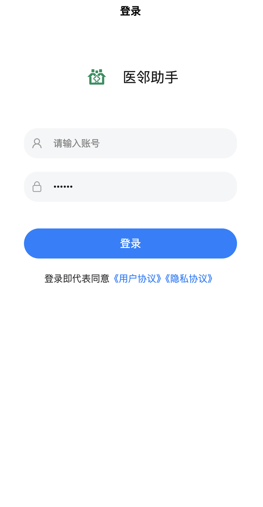</td>
    </tr>
</table>

## 项目部署

> 前提条件：基于ubuntu20.04安装docker，mysql，nginx，pip3,openjdk11,docker-compose

### 一．webase-deploy部署

解压webase-deploy.zip
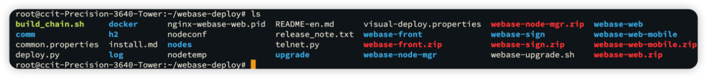
相关配置参照官方文档，不再赘述。

### 二．IPFS 容器部署
1. 解压ipfs-cluster.zip文件
2. 进入文件之后 docker-compose up 一键启动

### 三．项目基础服务环境准备
进入如下目录

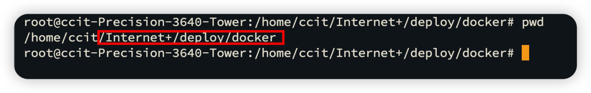
容器内部相关配置默认不需要修改（确认mysql服务端口是否为23306）

启动start.sh脚本

### 四．dataexport数据导出组件部署

[参阅官方文档不在赘述](https://data-doc.readthedocs.io/zh-cn/latest/docs/WeBankBlockchain-Data-Export/)

### 五．fastgpt部署
1. 解压fastgpt-cp.tar.gz文件
2. 输入docker-compose up启动容器
3. 本地无网络使用需要获取ollama大模型支持

更多内容参阅fastgpt官网
https://fastgpt.cn/zh

### 六．禅道任务管理系统
docker部署参阅官方文档
https://www.zentao.net/book/zentaopmshelp/405.html

### 七．项目部署
1. 在本地打包golang linux amd可执行文件并上传至部署目录

2. 构建镜像容器
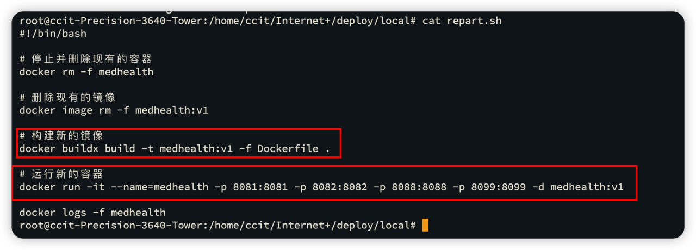

3. 检查是否运行成功
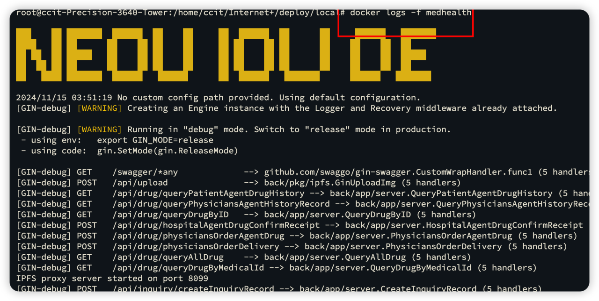

<!-- ### 八．Grafana数据大屏监控组件 -->