<div align="center">
<!-- markdownlint-disable first-line-h1 -->
<!-- markdownlint-disable html -->
<!-- markdownlint-disable no-duplicate-header -->


# 医邻助手 - Medical Neighbor Assistant

**🏥 社区家庭医生问诊管理系统** 

<div align="center">

[](https://golang.org/)
[](https://github.com/your-repo/medical-neighbor/releases)
[](LICENSE)
[](https://docker.com)
[](https://github.com/your-repo/medical-neighbor)

</div>

[📖 项目文档](#-项目文档) | [🚀 快速开始](#-快速开始) | [🏗️ 项目结构](#-项目结构) | [📸 软件截图](#-软件截图) | [🔧 系统部署](#-系统部署)

</div>

## 🎯 项目简介

**医邻助手** 是一个专为社区医疗场景设计的家庭医生问诊管理系统，通过数字化手段提升社区医疗服务效率，实现医患高效连接。

### ✨ 核心特性
- 🏥 **家庭医生签约服务** - 支持家庭医生与居民签约管理
- 💬 **在线问诊咨询** - 实时医患沟通，图文语音问诊
- 💊 **智能药品管理** - 药品库存管理，处方流转
- 🤖 **AI辅助诊断** - 智能问诊总结，辅助医疗决策
- 🔗 **区块链存证** - 医疗数据安全上链，确保数据可信
- 📱 **多端适配** - Web管理后台 + 移动APP双端支持

## 🏗️ 项目结构

| 🎯 子项目 | 📁 项目路径 | 📝 描述 |
|----------|------------|---------|
| 🖥️ 后端服务 | [`/back`](./back) | Go语言开发的RESTful API服务 |
| 📱 移动端 | [`/front/uniapp`](./front/uniapp) | 基于UniApp的跨平台移动应用 |
| 🌐 管理后台 | [`/front/web`](./front/web) | Vue3 + Vite构建的Web管理后台 |
| ⛓️ 智能合约 | [`/truffle/contracts`](./truffle/contracts) | Solidity智能合约，基于FISCO-BCOS |
| 📊 监控面板 | [`/grafana`](./grafana) | Grafana数据可视化监控配置 |
| 🚀 部署脚本 | [`/deploy`](./deploy) | Docker容器化部署方案 |

## 🔧 技术栈

<div align="center">

| 类别 | 技术栈 |
|------|--------|
| **后端** |    |
| **前端** |    |
| **移动端** |   |
| **区块链** |   |
| **数据库** |   |
| **AI/ML** |   |
| **容器化** |   |

</div>

## 📊 功能模块

| 🎯 功能模块 | 📝 功能描述 | 🏷️ 状态 |
|------------|-------------|---------|
| 👤 用户管理 | 用户注册、登录、信息修改、信息查询 | ✅ 已完成 |
| 👨‍⚕️ 医生管理 | 医生注册、登录、信息修改、信息查询 | ✅ 已完成 |
| 💬 问诊管理 | 用户向医生发起问诊、医生接单、问诊记录查询 | ✅ 已完成 |
| 💊 药品管理 | 药品信息管理、药品库存管理、药品购买 | ✅ 已完成 |
| 🤖 AI问诊 | 问诊总结、智能辅助诊断 | ✅ 已完成 |
| 📱 即时通讯 | 实时消息推送、医患沟通 | ✅ 已完成 |
| ⛓️ 区块链存证 | 医疗数据上链、不可篡改记录 | ✅ 已完成 |
| 📊 数据监控 | 系统运行状态监控、数据可视化 | ✅ 已完成 |

## 📸 软件截图

### 📱 移动端界面
<div align="center">
<table>
    <tr>
        <td>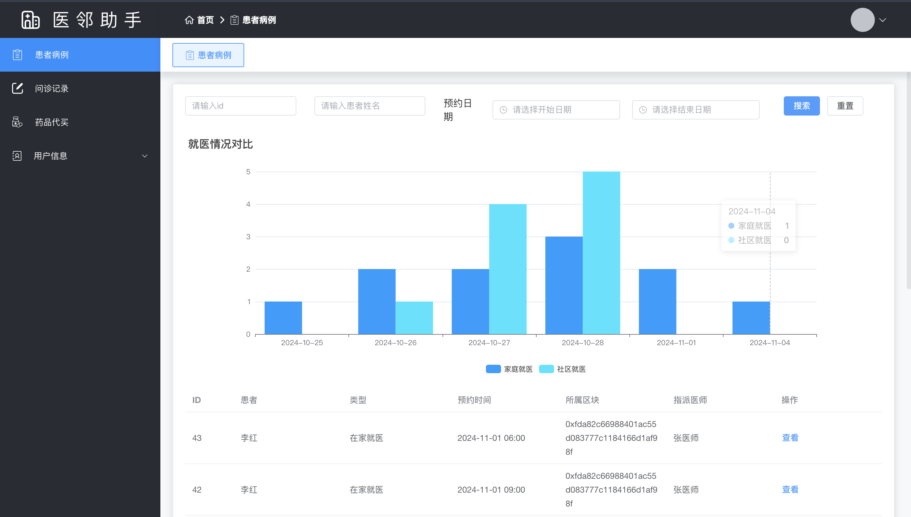</td>
        <td>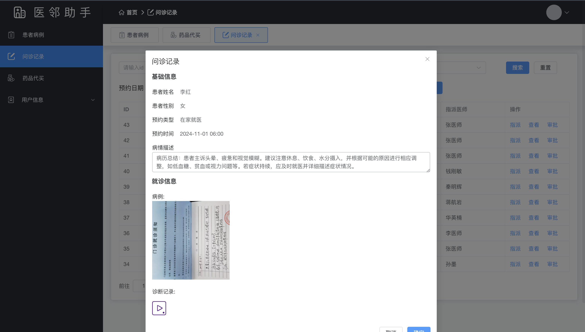</td>
    </tr>
    <tr>
        <td align="center"><strong>🏠 首页</strong></td>
        <td align="center"><strong>💬 在线问诊</strong></td>
    </tr>
    <tr>
        <td>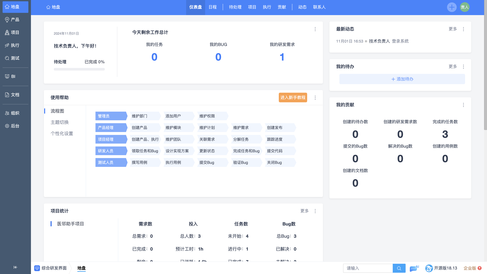</td>
        <td>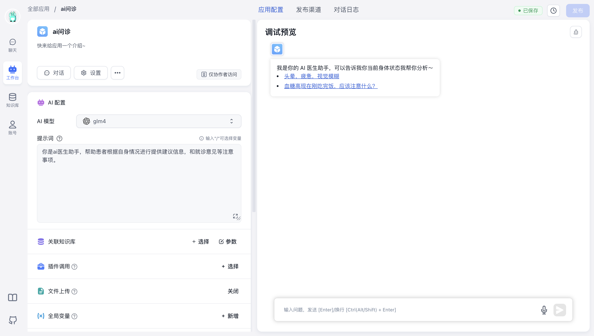</td>
    </tr>
    <tr>
        <td align="center"><strong>💊 药品商城</strong></td>
        <td align="center"><strong>👤 个人中心</strong></td>
    </tr>
</table>
</div>

### 🖥️ 管理后台界面
<div align="center">
<table>
    <tr>
        <td>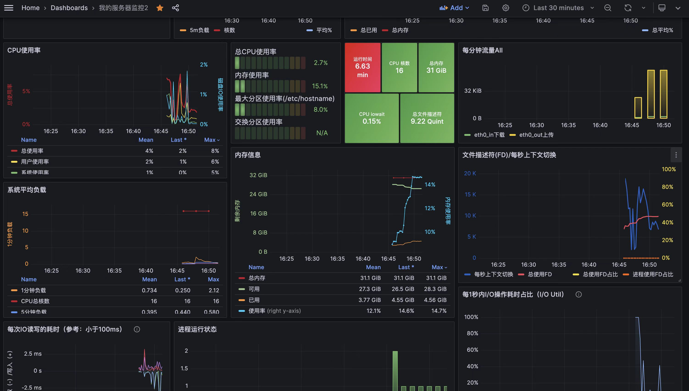</td>
        <td>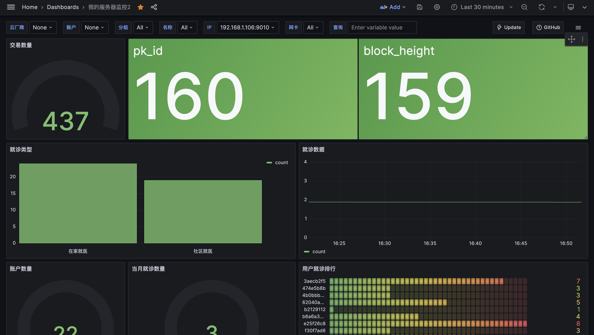</td>
    </tr>
    <tr>
        <td align="center"><strong>📊 数据概览</strong></td>
        <td align="center"><strong>📈 统计分析</strong></td>
    </tr>
    <tr>
        <td>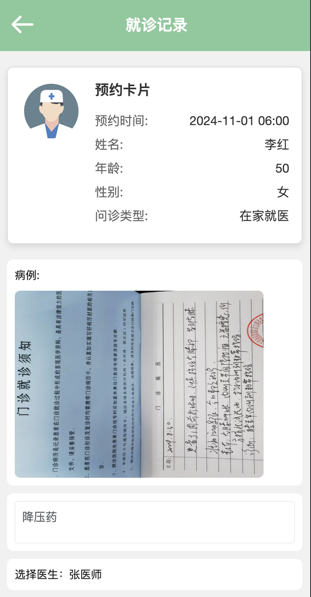</td>
        <td>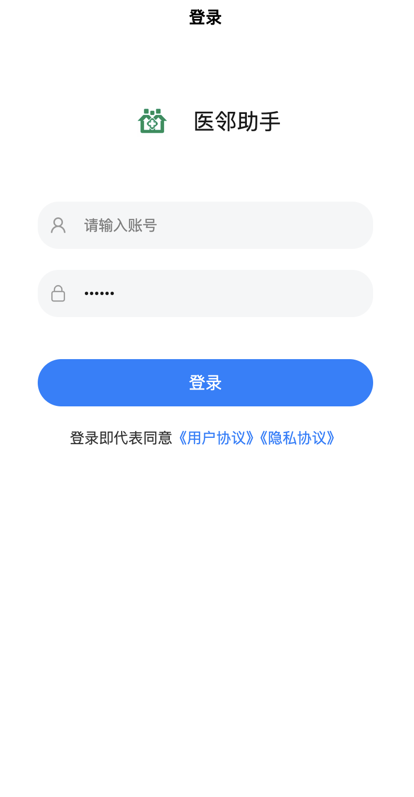</td>
    </tr>
    <tr>
        <td align="center"><strong>👥 用户管理</strong></td>
        <td align="center"><strong>⚙️ 系统配置</strong></td>
    </tr>
</table>
</div>

## 🏗️ 系统架构

<div align="center">

### 🔗 系统架构图
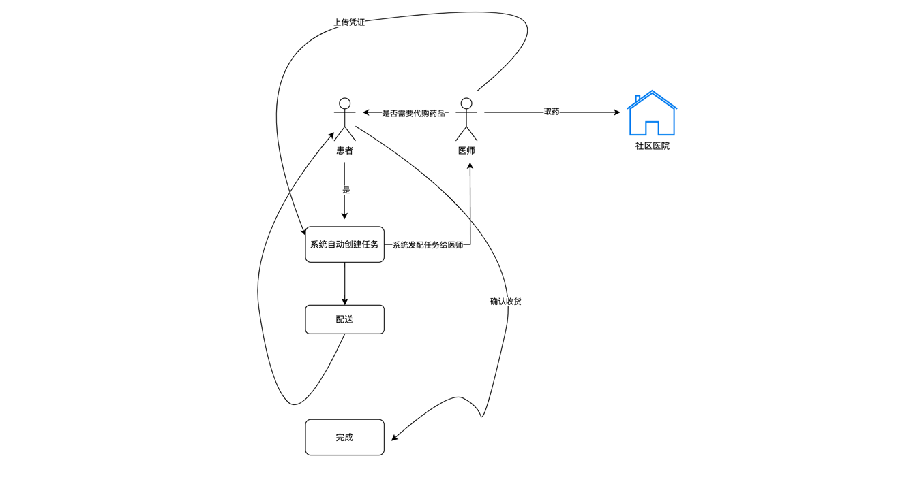

### 📊 数据流图
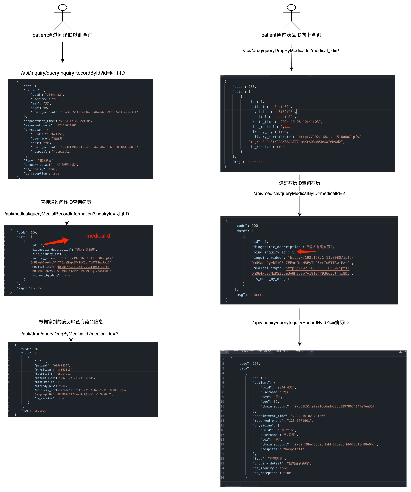

</div>

## 🚀 快速开始

### 📋 环境要求

- **操作系统**: Ubuntu 20.04+ / macOS 10.15+ / Windows 10+
- **Docker**: 20.10+
- **Docker Compose**: 2.0+
- **Go**: 1.22+
- **Node.js**: 16+
- **MySQL**: 8.0+
- **Redis**: 6.0+

### 🛠️ 本地开发环境搭建

#### 1️⃣ 克隆项目
```bash
git clone https://github.com/your-repo/medical-neighbor.git
cd medical-neighbor
```

#### 2️⃣ 启动基础服务
```bash
# 进入部署目录
cd deploy/docker

# 启动MySQL、Redis等基础服务
docker-compose up -d
```

#### 3️⃣ 启动后端服务
```bash
# 进入后端目录
cd back

# 安装依赖
go mod tidy

# 启动服务
go run main.go
```

#### 4️⃣ 启动前端服务
```bash
# Web管理后台
cd front/web
npm install
npm run dev

# 移动端开发
# 使用HBuilderX打开 front/uniapp 项目
```

## 🔧 系统部署

### 📋 部署前准备

> **前提条件**：基于Ubuntu 20.04安装docker、mysql、nginx、pip3、openjdk11、docker-compose

### 🚀 一键部署

我们提供了完整的Docker容器化部署方案，支持一键启动所有服务：

```bash
# 克隆项目
git clone https://github.com/your-repo/medical-neighbor.git
cd medical-neighbor/deploy

# 一键启动所有服务
./start.sh
```

### 📖 详细部署步骤

#### 1️⃣ WeBASE-Deploy部署
<div align="center">
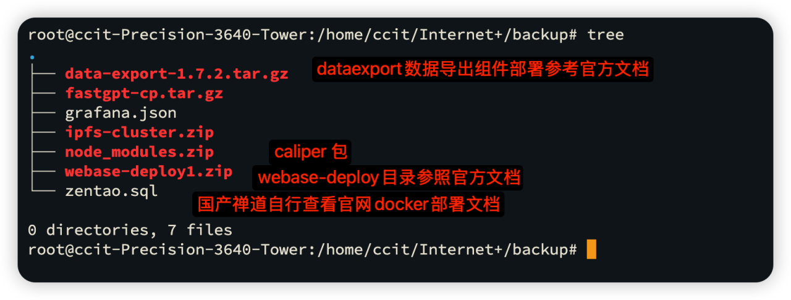
</div>

- 解压`webase-deploy.zip`
- 相关配置参照[官方文档](https://webasedoc.readthedocs.io/)

#### 2️⃣ IPFS容器部署
```bash
# 解压并启动IPFS集群
tar -xzf ipfs-cluster.zip
cd ipfs-cluster
docker-compose up -d
```

#### 3️⃣ 基础服务环境
<div align="center">
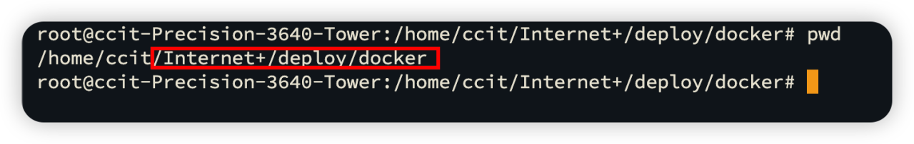
</div>

- 进入`deploy/docker`目录
- 确认MySQL服务端口是否为23306
- 启动`start.sh`脚本

#### 4️⃣ DataExport数据导出组件
参考[官方文档](https://data-doc.readthedocs.io/zh-cn/latest/docs/WeBankBlockchain-Data-Export/)

#### 5️⃣ FastGPT AI服务部署
```bash
# 解压并启动FastGPT
tar -xzf fastgpt-cp.tar.gz
cd fastgpt
docker-compose up -d
```

#### 6️⃣ 禅道任务管理系统
参考[禅道官方文档](https://www.zentao.net/book/zentaopmshelp/405.html)

#### 7️⃣ 系统部署验证
<div align="center">
<table>
    <tr>
        <td>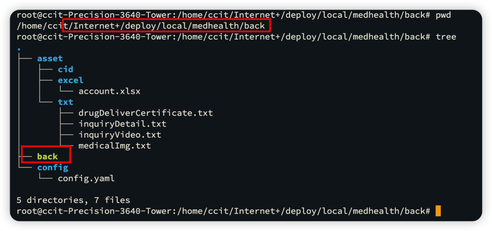</td>
        <td>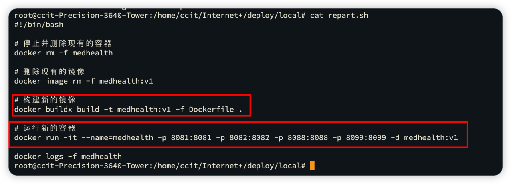</td>
        <td>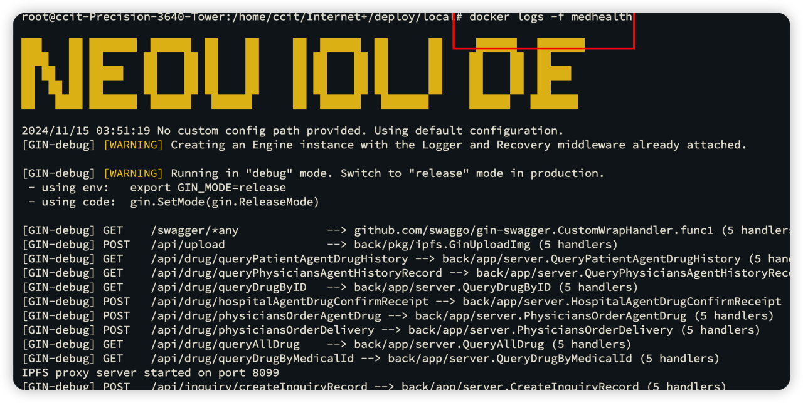</td>
    </tr>
    <tr>
        <td align="center"><strong>📦 构建镜像</strong></td>
        <td align="center"><strong>🐳 容器启动</strong></td>
        <td align="center"><strong>✅ 运行验证</strong></td>
    </tr>
</table>
</div>

## 📖 项目文档

- 📋 [API文档](./back/docs/docs.go) - Swagger API文档
- 🔧 [部署指南](./deploy/README.md) - 详细部署教程
- 🎯 [开发文档](./docs/医邻助手.md) - 开发规范与指南
- 📊 [系统架构](./static/数据表连查关系图.html) - 数据库设计文档

## 🤝 贡献指南

我们欢迎所有形式的贡献！

- 🐛 [报告Bug](https://github.com/your-repo/medical-neighbor/issues)
- 💡 [功能建议](https://github.com/your-repo/medical-neighbor/issues)
- 📖 [文档改进](https://github.com/your-repo/medical-neighbor/pulls)
- 🌟 [代码贡献](https://github.com/your-repo/medical-neighbor/pulls)

## 📄 许可证

本项目基于 [MIT License](LICENSE) 开源协议。

## 🙏 致谢

感谢以下开源项目为本项目提供支持：

- [Gin](https://github.com/gin-gonic/gin) - Go Web框架
- [Vue.js](https://vuejs.org/) - 前端渐进式框架
- [FISCO-BCOS](https://github.com/FISCO-BCOS/FISCO-BCOS) - 区块链底层平台
- [FastGPT](https://fastgpt.cn) - AI大模型服务平台

---

<div align="center">

**⭐ 如果这个项目对你有帮助，请给我们一个Star！**

</div>

